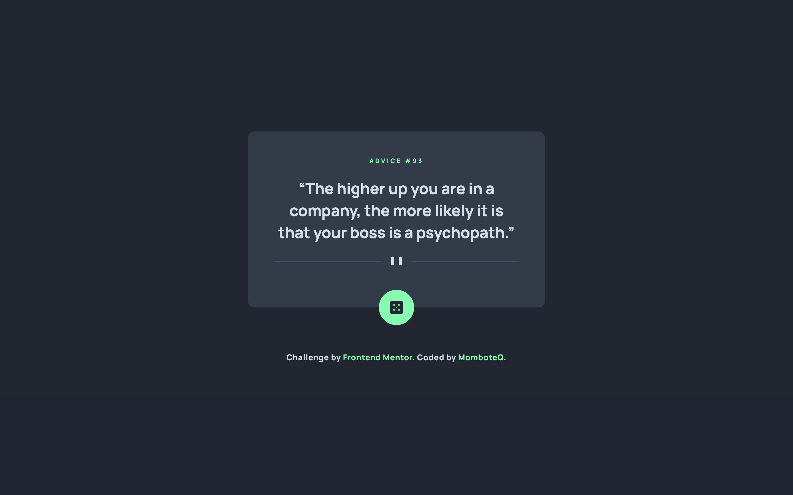
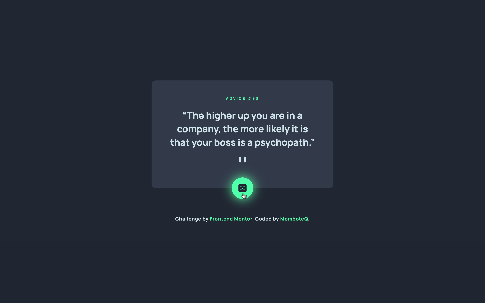
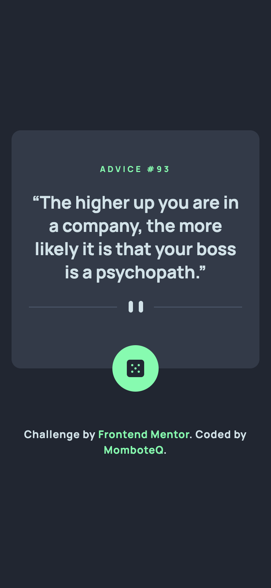

# Frontend Mentor - Advice generator app solution

This is a solution to the [Advice generator app challenge on Frontend Mentor](https://www.frontendmentor.io/challenges/advice-generator-app-QdUG-13db). Frontend Mentor challenges help you improve your coding skills by building realistic projects.

## Table of contents

- [Overview](#overview)
  - [The challenge](#the-challenge)
  - [Screenshot](#screenshot)
  - [Links](#links)
- [Built with](#built-with)
- [Author](#author)

## Overview

### The challenge

Users should be able to:

- View the optimal layout for the app depending on their device's screen size
- See hover states for all interactive elements on the page
- Generate a new piece of advice by clicking the dice icon

### Screenshot

### Desktop view

### Mobile view

### Links

- Live Site URL: [Live Site](https://momboteq.github.io/advice-generator-app)

## My process

### Built with

- Flexbox
- Mobile-first workflow
- [React](https://reactjs.org) - JS library
- [Tailwind CSS](https://tailwindcss.com) - CSS Framework

## Author

- Website - [MomboteQ.github.io](https://MomboteQ.github.io)
- Frontend Mentor - [@MomboteQ](https://www.frontendmentor.io/profile/MomboteQ)
